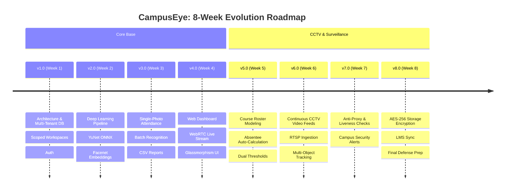

# CampusEye: Sophisticated Campus Monitoring System

**Senior Design Project (CSE 499A / CSE 499.15 — Fall 2026)**  
**Department of Electrical & Computer Engineering, North South University**

---

## 👥 Authors & Lead Developers
* **Rafiqul Islam** (ID: 2122414642) — `rafiqul.islam12@northsouth.edu`
* **Safayat Ibrahim** (ID: 2131174642) — `safayat.ibrahim@northsouth.edu`

**Supervisor:** Mohammad Shifat-E-Rabbi

---

## 📌 Project Vision & Overview
**CampusEye: Sophisticated Campus Monitoring System** is an enterprise-grade, AI-driven computer vision ecosystem engineered to modernize attendance management, security surveillance, and student verification across university campuses.

Starting from an automated single-photo classroom attendance pipeline, CampusEye systematically expands into a **full-campus continuous CCTV monitoring network** capable of multi-camera student tracking, proxy attempt detection, real-time security alerts, and seamless LMS synchronization.

### Key Pillars & Capabilities
* 📸 **Single-Photo & Continuous CCTV Monitoring:** Processes single group snapshots or continuous RTSP video feeds from campus IP cameras.
* 🧠 **Deep Learning AI Engine:** Powered by **YuNet ONNX CNN** for high-density multi-scale face detection and **DeepFace (FaceNet / ArcFace)** for robust facial embedding extraction.
* 👤 **Multi-Sample Biometric Enrollment:** 10 face captures from varied angles averaged into invariant mathematical templates.
* 🛡️ **Anti-Proxy & Liveness Verification:** Multi-frame presence checks and anomaly alerts for impossible travel (same student detected in two locations simultaneously).
* 🔒 **Enterprise Multi-Tenancy & Privacy:** Scoped workspaces for faculty, hashed credentials, and AES-256 encrypted biometric storage.
* 📊 **Faculty Analytics & LMS Export:** Real-time presence logs, student absence detection, and CSV/Excel exports.

---

## 🗺️ 8-Week Version-by-Version Strategic Roadmap



| Version | Milestone | Key Deliverables & Features |
| :--- | :--- | :--- |
| **v1.0** | **Week 1: Infrastructure & Auth** | Modular directory setup, SQLite multi-tenant schema with `owner_id` scoping, Werkzeug password hashing. *(Completed)* |
| **v2.0** | **Week 2: Deep Learning Engine** | YuNet ONNX face detection, DeepFace Facenet 128-d embeddings, cosine distance comparison, 10-sample enrollment. *(Completed)* |
| **v3.0** | **Week 3: Single-Photo Attendance** | Batch classroom photo processing, duplicate marking prevention, CSV exports, unknown face capture queue. *(Completed)* |
| **v4.0** | **Week 4: WebRTC & Dashboard UI** | Responsive Flask Glassmorphism web interface, browser WebRTC camera streaming, real-time bounding boxes. *(Current)* |
| **v5.0** | **Week 5: Course & Roster Modeling** | Relational `classes` and `enrollments` tables, automatic calculation of **Present vs. Absent** students per section, dual-threshold flags ($\tau, \tau_{low}$). |
| **v6.0** | **Week 6: Continuous CCTV Streaming** | RTSP/HTTP continuous video feed ingestion from campus IP cameras, frame downsampling, multi-frame face tracking (DeepSORT/ByteTrack). |
| **v7.0** | **Week 7: Anti-Proxy & Security Alerts** | Proxy prevention via anomaly detection (e.g. rapid spatial conflicts, double attendance), real-time alerts for faculty and campus security. |
| **v8.0** | **Week 8: Enterprise Security & Defense** | AES-256 biometric encryption at rest, university LMS REST API sync, 50+ face classroom scale benchmark, final thesis defense deck. |

---

## 📂 Final Project Submission (CSE499A)

All final project materials are available in the following Google Drive folder:

🔗 **[Final Submission – Video Presentation, Presentation Slides, Demo Video & Final Report](https://docs.google.com/presentation/d/1MZN2bvVqSlva_E9sGZ7TZaIBPYsc6K2N/edit?usp=drive_link&ouid=105112015491029026132&rtpof=true&sd=true)**

The folder contains:

- 🎥 Final Video Presentation
- 🖥️ Final Presentation Slides
- 💻 Project Demo Video
- 📄 Final Project Report
---

## 🚀 Quick Start Guide

### Prerequisites
* Python 3.10+
* Virtual environment (`.venv`) with dependencies installed

### Running the Web Application
```bash
# Navigate to attendance_system directory
cd attendance_system

# Launch the Flask server using the project virtualenv
.venv\Scripts\python main.py
```

Open your browser and navigate to:
👉 **[http://127.0.0.1:5000](http://127.0.0.1:5000)**

---

## 🧪 Running Automated Tests
```bash
cd attendance_system
.venv\Scripts\pytest -v tests/
```

---

## 📂 Project Architecture
```
attendance_system/
├── config.py                 # System thresholds, paths & DeepFace configuration
├── main.py                   # Application entry point
├── requirements.txt          # Python dependencies
├── database/
│   ├── db_manager.py         # SQLite schema, user auth CRUD & data isolation
│   └── attendance.db         # Auto-generated database
├── models/
│   ├── yunet.onnx            # Pre-trained CNN face detector
│   └── cascades/             # Haar Cascade fallback
├── utils/
│   ├── detection.py          # YuNet & Haar multi-face detection
│   ├── recognition.py        # DeepFace embedding extraction & cosine matching
│   ├── registration.py       # Multi-sample student enrollment
│   ├── attendance.py         # Attendance pipeline & CSV report export
│   ├── auth.py               # Account creation & password verification
│   └── image_processing.py   # Lighting normalization (CLAHE) & resize utils
├── web/
│   ├── app.py                # Flask routes & JSON REST API
│   ├── auth.py               # Login, Sign-up, Logout routes
│   ├── static/               # CSS (Glassmorphism UI) & Vanilla JavaScript
│   └── templates/            # Jinja2 HTML templates
└── tests/
    ├── test_auth.py          # Multi-account isolation & authentication tests
    ├── test_logic_non_interactive.py # Core registration & pipeline tests
    ├── test_week3.py         # Attendance marking test
    └── test_week5.py         # Documentation test
```
